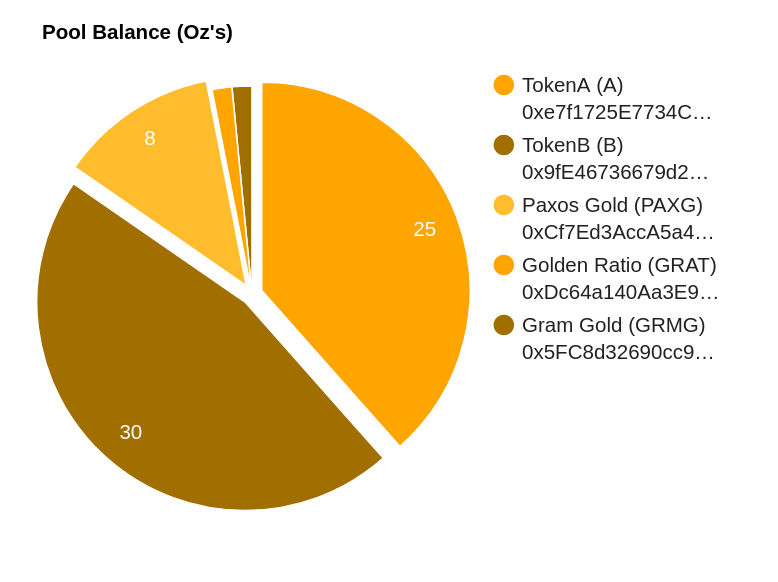
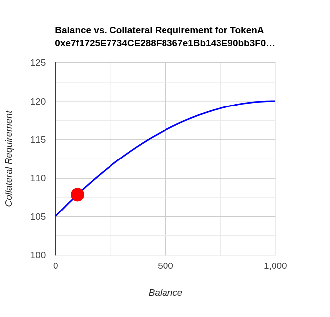

# Solidus Gold

## Overview

**Solidus Gold** is a decentralized gold-backed token designed to mitigate institutional and systemic risks associated with traditional gold tokens. By backing Solidus Gold with a diversified pool of various gold tokens, we reduce the potential impact of adverse events on any single token, ensuring a more stable and resilient store of value.



## Motivation

In 1933, the United States enacted the Gold Reserve Act, making it illegal for citizens to own gold. This historical precedent highlights the risks that centralized regulations can pose to decentralized finance (DeFi) protocols that rely on gold-backed tokens. If gold tokens were to gain widespread use and were primarily based in the U.S., DeFi protocols would face significant risk from potential regulatory changes, undermining the timeless value of gold.

Gold stablecoins are also exposed to other risks, such as wars or natural disasters that could affect the operations of the stablecoin providers. In the event of a depegging incident, protocols or individuals relying on these tokens could suffer significant losses if they are unable to quickly transition to other assets.

**Solidus Gold** addresses these risks by pooling together multiple gold tokens, actively managing real-world risks through DAO governance and algorithmic processes, and producing a derivative gold token that can be held indefinitely with a drastically reduced risk of devaluation.

## Key Benefits

- **Diversification of Risk**: By pooling together multiple gold tokens, we reduce reliance on any single centralized institution, spreading risk across a broader base.
- **Resilience to External Events**: Active management and governance allow the protocol to respond to real-world risks, preserving the stability of the token.
- **Enhanced Stability**: Over-collateralization and algorithmic risk management minimize the risk of depegging events.
- **Preservation of Gold’s Value**: Solidus Gold maintains the intrinsic benefits of physical gold as a store of value while removing the drawbacks associated with centralized gold-backed tokens.

## Technical Details

### Smart Contract Mechanism

The Solidus Gold protocol operates via a single smart contract that manages an array of 'approved tokens.' These tokens can be deposited and redeemed by users, with the protocol maintaining over-collateralization to prevent depegging events.

### Collateral Requirement Calculation

The collateral requirement for minting new Solidus Gold tokens is determined by a quadratic function that scales based on the balance of the pool. The formula ensures that as the pool's balance approaches its supply cap, the collateral required increases, reducing the risk of over-exposure to any single token.

#### Function Definitions

- **balance**: The current balance of the token in the pool.
- **supplyCap**: The maximum amount of tokens that can be deposited into the pool.
- **maxRiskParameter**: The maximum collateral requirement.
- **minRiskParameter**: The minimum collateral requirement.

The collateral requirement is calculated using the following quadratic function:

```math
f(x) = a(\text{balance} - \text{supplyCap})^2 + \text{maxRiskParameter}
```

where:

```math
a = \frac{\text{minRiskParameter} - \text{maxRiskParameter}}{\text{supplyCap}^2}
```

To calculate the collateral percentage required for a deposit, the area under the quadratic curve from the initial balance to the final balance must be integrated:

```math
F(x) = \frac{a}{3}(x - \text{supplyCap})^3 + \text{maxRiskParameter} \times x
```

The integral is evaluated from the initial balance to the final balance after the deposit:

```math
\text{Collateral Requirement} = \int_{b}^{a} F(x) dx
```

Finally, this result is divided by the deposit amount to obtain the collateral percentage required for the deposit.

